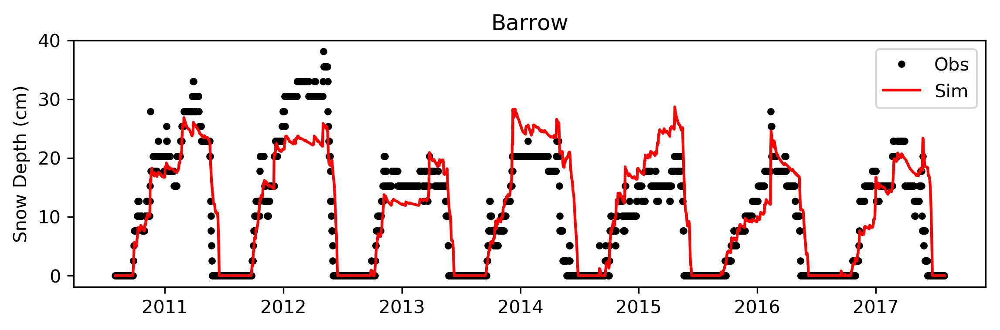

This is a simple snow model with BMI ([Basic Modeling Interface](https://bmi-spec.readthedocs.io/en/latest/) of [CSDMS](https://csdms.colorado.edu/wiki/Main_Page)) in Fortran cooperatively-developed by **Kang Wang** (University of Colorado Boulder), **Ross Brown** (Environment Canada), and **Bruce Brasnett** (Canadian Meteorological Centre). It's an empirical algorithm to melt snow according to the surface temperature and increase snow depth according to the precipitation that has fallen since the last analysis time. Details of BMI-Fortran could be found at https://github.com/csdms/bmi-fortran.

**If you are using this code, PLEASE CITE:**

> *Brown, R.D., B. Brasnett and D. Robinson. 2003. Gridded North American monthly snow depth and snow water equivalent for GCM evaluation. Atmosphere-Ocean. 41:1-14.* (https://www.tandfonline.com/doi/abs/10.3137/ao.410101)

The inputs [**Daily**] are

| Standard Name                             | Description                                                                                                                       | Unit     | Type    |
|-------------------------------------------|-----------------------------------------------------------------------------------------------------------------------------------|----------|---------|
| land\_surface\_air\_\_temperature             | SURFACE TEMPERATURE FIELDS (TEMPERATURES FROM THE START TO THE END OF THE INTERVAL)                                               | deg.C    | Real    |
| precipitation\_mass\_flux                   | PRECIPITATION FIELD                                                                                                               | mm       | Real    |
| snowpack\_\_initial\_depth                   | INITIAL SNOW DEPTH                                                                                                                | cm       | Real    |
| snowpack\_\_initial\_mass-per-volume_density | INITIAL MEAN DENSITY OF SNOW PACK                                                                                                 | kg3/m3   | Real    |
| snow_class                                | SNOW CLIMATE CLASS, STURM et al. (1995) **[0-7]**                                                                                       | unitless | Integer |
| open\_area\_or_not                          | FORESTED/OPEN FLAG FOR VALIDATING RESULTS IN BOREAL, FOREST ZONE (MOST SNOW DEPTHS MEASURED AT OPEN SITES) **[1: Open, 0: Forested]** | unitless | Integer |
| precipitation\_mass\_flux\_adjust\_factor | Adjustment factor of precipitation [**0-1**]. Adjust precip for canopy interception/sublimation | unitless | Real|

**Reference:**
Sturm, M., J. Holmgren, and G.E. Liston, 1995: A Seasonal Snow Cover Classification System for Local to Global Applications. J. Climate, 8, 1261–1283.

The outputs [**Daily**] are

| Standard Name                     | Description               | Unit   | Type |
|-----------------------------------|---------------------------|--------|------|
| snowpack__depth                   | SNOW DEPTH                | cm     | Real |
| snowpack\_\_mass-per-volume_density | MEAN DENSITY OF SNOW PACK | kg3/m3 | Real |

### 1. Compile with cmake ###

> `mkdir _build && cd _build`  
> `cmake .. -DCMAKE_INSTALL_PREFIX=[install_path]`  
> `make install`  
> `source ../scripts/update_rpaths.sh`  
> `ctest`

**If you want to run the compiled BMI model:**

> `cd [install_path]/bin/`  
> `./run_bmisnow_model [configuration_file]`

e.g., 
`./run_bmisnow_model ../../Snow_BMI_Fortran/snow/snow_model_test.cfg`

### 2. How do you prepare your cases ###

**NOTE:** The input files path in configuration file may need to be changed:

> Input Files Path  
> /Users/kangwang/Documents/simple\_snow_model/

if you put the input files under the same directory to the configuration file, **please leave the second line as BLANK**.

Snow class map of Sturm et al. (1995) could be obtained from: https://arcticdata.io/catalog/view/doi:10.5065/D69G5JX5. **[0.5 deg, global]**

### 3. Example outputs at Barrow, Alaska

